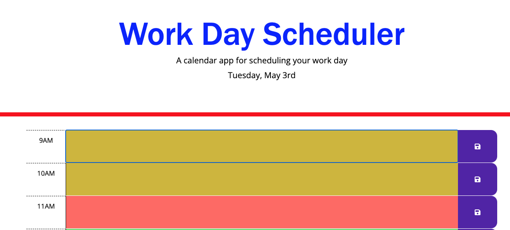

# Work-Day-Scheduler

## Description 

This application is supposed to use jquery, bootstrap, and moment.js to create evens in a day planner. The requirement is that events be entered in the schedule for each hour and the app will keep track of time by coloring each hour with colors for past, present, and future.

## Technology Used

* HTML
* CSS
* Bootstrap
* moment.js

Link to deployed application 
Website URL:[Work-Day-Scheduler](https://molano1979.github.io/Work-Day-Scheduler/)

## Questions
✉️ Contact me with any questions: [email](mailto:dmmolano@yahoo.com) , [GitHub](https://github.com/molano1979) 

